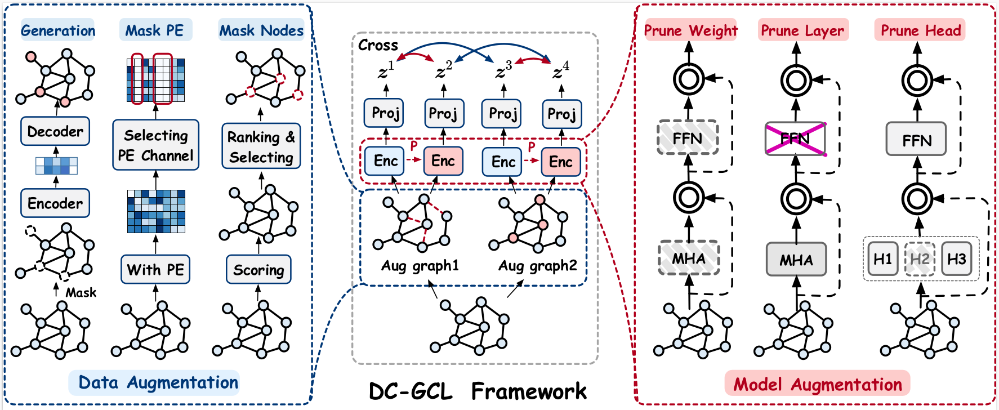

# Dual-perspective Cross Contrastive Learning in Graph Transformers

## Overview



This paper presents **DC-GCL**, a method innovatively includes dual-perspective augmentation and multi-view contrastive loss modules. We also proposed three strategies to generate more reliable positive samples for the data and model augmentation perspectives. Through comprehensive experiments covering two distinct graph learning tasks, DC-GCL demonstrated superior performance compared to the single augmentation strategy. Furthermore, DC-GCL consistently demonstrated its ability to distinguish between various positive sample pairs and exhibited superior generalization capabilities. 

### Python environment setup with Conda

```
conda create -n dcgcl python=3.11
conda activate dcgcl
conda install pytorch==2.1.0 torchvision==0.16.0 torchaudio==2.1.0 pytorch-cuda=11.8 -c pytorch -c nvidia
conda install pyg -c pyg
pip install configargparse
pip install pyg_lib torch_scatter torch_sparse torch_cluster torch_spline_conv -f https://data.pyg.org/whl/torch-2.1.0+cu118.html

```

### Running DC-GCL

Running unsupervised graph classification:

```
conda activate dcgcl
# Running DC-GCL tuned hyperparameters for TuDataset.
sh ./scripts/dd.sh 
sh ./scripts/COLLAB.sh 
sh ./scripts/protein.sh 
```

Running transfer learning on molecular property prediction:

```
conda activate dcgcl
cd transfer
# Pretraining DC-GCL on ZINC15.
python pretrain_dcgcl.py
# Finetuning DG-GCL on MoleculeNet datasets.
i.e. finetune on BACE
sh ./scripts/bace.sh
```

Supported datasets:

- TUDataset: `NCI1`, `PROTEINS`, `D&D`, `IMDB-BINARY`, `MUTAG`, `COLLAB`, `REDDIT-BINARY`,`REDDIT-MULTI-5K`
- MoleculeNet: `BBBP`, `Tox21`, `ToxCast`, `SIDER`, `ClinTox`, `MUV`, `HIV`, `BACE` 

### Baselines

- GraphTrans:https://github.com/ucbrise/graphtrans
- GraphGPS:https://github.com/rampasek/GraphGPS/tree/main
- GraphCL:https://github.com/Shen-Lab/GraphCL/tree/master
- JOAO:https://github.com/Shen-Lab/GraphCL_Automated/tree/master
- SimGRACE:https://github.com/junxia97/SimGRACE
- DRGCL:https://github.com/ByronJi/DRGCL

## Datasets

Datasets mentioned above will be downloaded automatically using PyG's API when running the code.

Gradformer is built using [PyG](https://www.pyg.org/) and [GraphCL](https://github.com/Shen-Lab/GraphCL/tree/master). 

